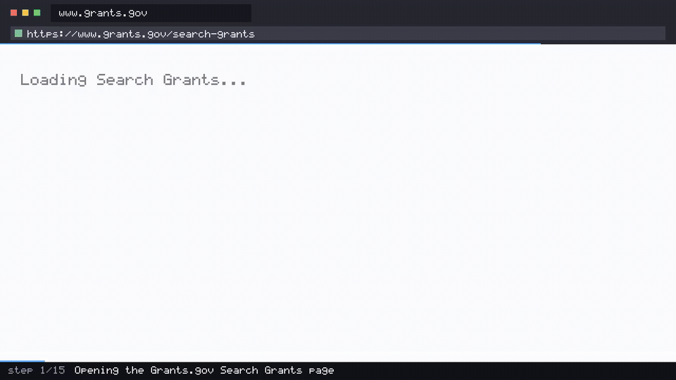

<div align="center">

# 🎗️ Nonprofit Grant Scan

**An AI agent that opens the federal grant portal, finds what is open in your field, and reports which deadlines are closest — then films itself doing it.**

[](https://github.com/coasty-ai/coasty-nonprofit-grant-scan/actions/workflows/ci.yml)
[](https://nodejs.org)
[](package.json)
[](#try-it-in-30-seconds)
[](LICENSE)



<sub>Every frame above is a **real screenshot the model actually saw** — pulled from the run's own model-input frames, not a reconstruction.</sub>

</div>

---

## What this is

A complete, production-grade [Coasty](https://coasty.ai) computer-use automation for **grant opportunity deadline scanning**. It gives an AI agent one goal in plain English, and the agent drives a real browser on a real cloud desktop to accomplish it — no selectors, no scraping rules, no DOM parsing to maintain.

A grant deadline is the least forgiving date a nonprofit has. Miss a close date on a federal opportunity and the next window is usually a year out, so somebody on the development team opens the portal, re-applies the same filters, and re-reads the same list every week. It is exactly the work that gets skipped in a busy month, and skipping it is what costs a funding cycle.

The usual fix is a scraper, and the usual outcome is a scraper that breaks. Funder portals get redesigned, filters move behind new controls, results turn into a different widget — and the pipeline goes quiet without failing loudly, which is worse than not having it. An agent works from the goal instead of the markup: it looks at the page the way a program officer would, so a redesign changes what it clicks, not whether it works. That matters more once you point the same automation at the funders that have no API at all — state agencies, community foundations, private funder portals.

**Zero dependencies. Runs offline for $0 on a fresh clone. ~$0.75 to run for real.**

```
"Go to https://www.grants.gov/search-grants and find the federal grant
 opportunities in the Education category that are currently open for
 applications — forecasted, closed and archived listings do not count.
 Determine how many open Education opportunities there are in total, then
 identify the three whose close date is nearest. Report the total count, and
 for each of those three the opportunity title, the funding agency offering
 it, and its close date. Stop once you have reported the count and all three;
 if there are no open Education opportunities, report that instead."
```

That prompt *is* the automation. When the site redesigns, the prompt still works. Swap `Education` for `Health`, or the URL for a state portal, and you have a different scan without touching a line of code.

## Try it in 30 seconds

No API key. No account. No install. No spend.

```bash
git clone https://github.com/coasty-ai/coasty-nonprofit-grant-scan
cd coasty-nonprofit-grant-scan
npm start
```

That boots a bundled offline mock in-process and runs the whole agent loop against it. Then render the demo video from the run's own frames:

```bash
npm run demo     # needs ffmpeg; writes media/demo.mp4 + demo.gif + poster.jpg
```

Check your setup any time with `npm run doctor`.

## Run it for real

```bash
export COASTY_API_KEY=sk-coasty-test-...      # sandbox keys never bill
export COASTY_BASE_URL=https://coasty.ai/v1
export COASTY_ALLOW_LIVE=1                     # destination consent
npm start -- --live --confirm-cost-cents 120   # cost consent
```

Both consents are required and they are deliberately separate. A live key alone will not spend; a base URL alone will not spend. See [Safety](#safety).

| | |
|---|---|
| Expected cost | **75¢** (15 steps × 5 credits) |
| Worst case | **120¢** (24-step cap) |
| Model-input frames | **free** |
| Machine runtime | Coasty provisions and destroys its own VM |

`npm run estimate` prints this before anything runs.

Grants.gov is public, so nothing here needs an account, a login or a credential.

## How it works

```
POST /v1/tasks                          Coasty provisions its own ephemeral VM,
                                        drives the agent, and destroys the VM
GET  /v1/runs/{id}                      poll to a terminal state
GET  /v1/runs/{id}/screenshots          the exact frames the model saw — free
GET  /v1/runs/{id}/events               per-step narration (SSE)
ffmpeg                                  frames → demo.mp4 + demo.gif + poster
```

The demo video is a **byproduct of running the automation**, not a separate artifact to author and keep in sync. There is no storyboard, no HTML mock, and nothing that can drift from reality — if the agent did something different, the video shows something different.

Verification is intrinsic and runs without a human watching:

```
✓ frames captured              15 frames
✓ frame count matches steps    15 frames vs 15 steps
✓ not all frames degraded      0 degraded
✓ frames are distinct          15/15 unique
✓ duration matches pacing      10.20s vs 10.20s expected
✓ stream width correct         1280x720
✓ video is non-trivial         306 packets
```

## Safety

This repo is built so that **accidental spend is structurally impossible**, not merely discouraged:

- **Fail-closed destination.** An unset `COASTY_BASE_URL` resolves to the bundled offline mock. Production is never a default.
- **Two independent consents.** `COASTY_ALLOW_LIVE=1` authorises the *destination*; `--confirm-cost-cents N` authorises the *cost*, and N must equal the server-computed worst case exactly.
- **Idempotency by default.** The submit key is derived from the prompt, so a retried submit returns the original run instead of provisioning a second machine.
- **A hard cap per unit.** A worst case above `capCents` in [`automation.json`](automation.json) is refused before any request is made.
- **No credentials, ever.** This automation targets a public site. Nothing here reads a password, a token, or a cookie.

## Project layout

```
automation.json      the entire unit definition — prompt, target, budget, caps
src/client.mjs       Coasty client: fail-closed target, retry, idempotency
src/capture.mjs      model-input frames → mp4/gif/poster, with sanity checks
src/cli.mjs          run · demo · estimate
tools/mock.mjs       the bundled offline Coasty (real 1280×720 PNG frames)
tools/doctor.mjs     preflight
test/                25 tests, zero dependencies, fully offline
```

Adding a new automation is one `automation.json` and one prompt — `src/` never forks. See [AGENTS.md](AGENTS.md) for the authoring contract used by Claude Code and Codex.

## Tests

```bash
npm test     # node --test, no install, no network, no key
```

## Related

Part of the **Coasty automation catalog** — production-grade computer-use automations across 12 industries. See [the index](https://github.com/coasty-ai) for finance, healthcare, legal, logistics, energy, public sector, HR, education, manufacturing, retail and e-commerce.

- [Coasty docs](https://coasty.ai/docs) · [API reference](https://coasty.ai/docs/llms.txt)
- [computer-use-cookbook](https://github.com/coasty-ai/computer-use-cookbook) — the API, by endpoint, in 4 languages
- [open-cowork](https://github.com/coasty-ai/open-cowork) — the open-source AI coworker

## License

MIT © Coasty
